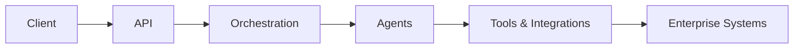
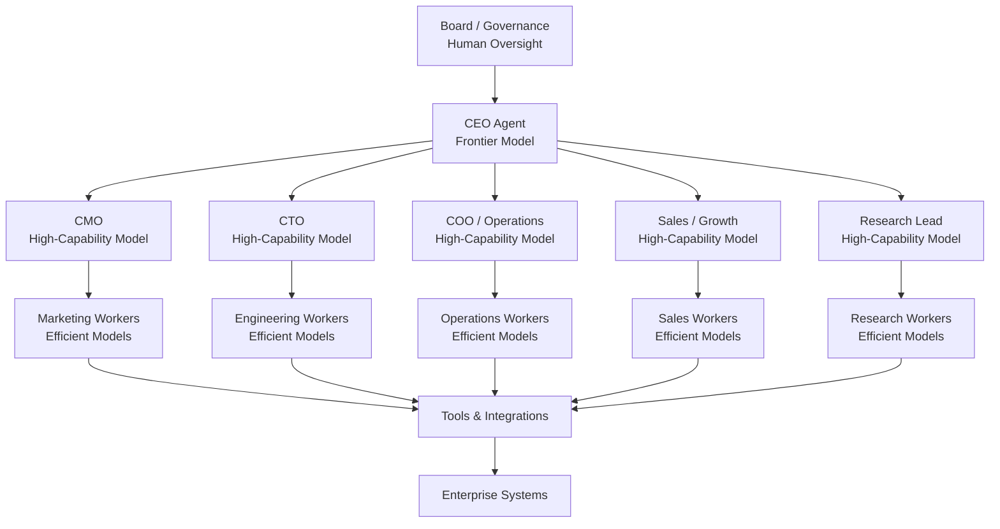
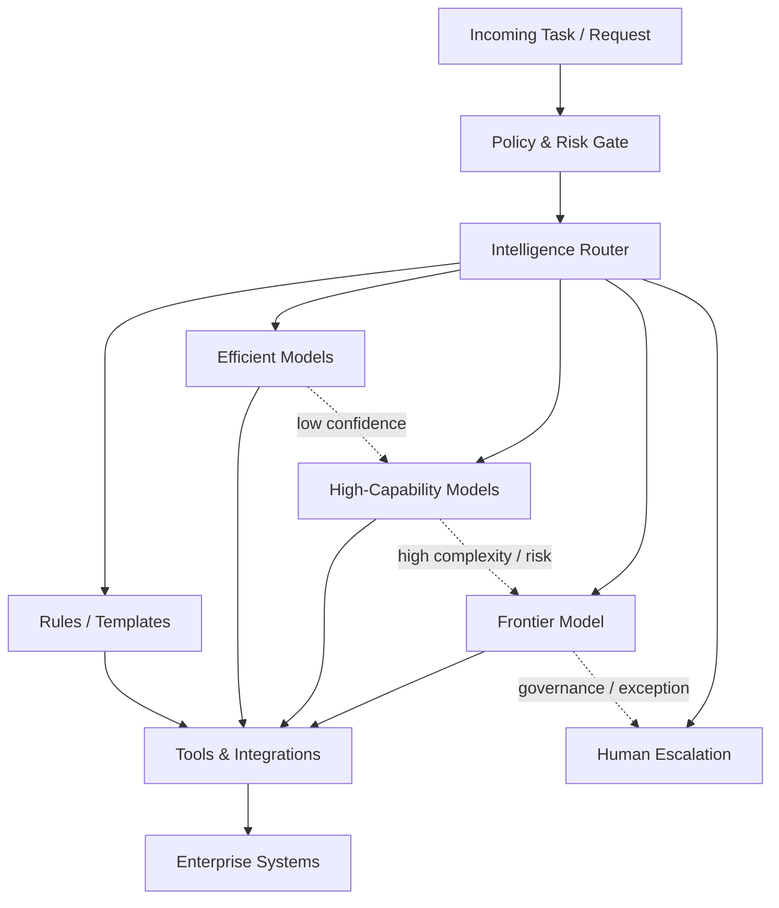

# Richard Russell

[Repositories](#key-repositories) • [Overview](#overview) • [Capabilities](#core-capabilities) • [Operating Model](#ai-company-operating-model) • [Experience](#experience)

Founder @ AI Venture X

Building and deploying enterprise-grade multi-agent AI systems at scale (100+ agents across production workflows)

---

## Key Repositories

- [enterprise-agentic-ai](https://github.com/Poochaman/enterprise-agentic-ai) — enterprise-grade multi-agent AI systems for automation and integration  
- [multi-agent-orchestration](https://github.com/Poochaman/multi-agent-orchestration) — orchestration and routing across specialist agents  
- [ai-agent-organisation](https://github.com/Poochaman/ai-agent-organisation) — agent roles, governance, and organisational structure  
- [white-label-ai-api](https://github.com/Poochaman/white-label-ai-api) — stateless API for embedding AI agents at scale  

---

## Featured Work

### Enterprise Agentic AI  
Design and deployment of enterprise-grade multi-agent AI systems for automation, integration, and operational workflows.

### Multi-Agent Orchestration  
Implementation of orchestration layers coordinating specialist agents across structured workflows and decision pipelines.

### AI Agent Organisation  
Development of agent-driven systems structured as organisational models with defined roles, delegation, and governance.

### White-Label AI API  
Stateless API infrastructure for embedding AI agents into applications, enabling scalable, white-label deployment.

---

## Overview

I design and deploy production AI systems that operate as coordinated multi-agent environments rather than isolated tools.

My work combines:
- 20+ years delivering large-scale, FCA-regulated transformation programmes (£250m+)  
- enterprise system integration across data, cloud, and operational platforms  
- 5+ years designing and deploying agentic AI systems and orchestration layers  

At AI Venture X:
- multi-agent systems operate across business workflows  
- AI is structured as organisational models rather than standalone tools  
- orchestration is built across multiple agent frameworks, model providers, and custom stacks  

These systems:
- automate complex business processes  
- integrate with enterprise infrastructure  
- operate reliably under real-world constraints  
- produce measurable commercial outcomes  

---

## Core Capabilities

- Multi-agent system design and orchestration  
- AI agent organisations with defined roles and governance  
- Stateless API architectures for scalable deployment  
- Integration with CRMs, internal systems, and external APIs  
- Workflow automation and decision routing  
- End-to-end delivery from architecture through to production deployment  

---

## Current Focus

- Scaling multi-agent systems (100+ agents across production workflows)  
- Building agentic orchestration layers across multiple frameworks, providers, and deployment models  
- Developing AI-driven organisations with defined roles and workflows  
- Deploying AI agents across enterprise, gaming, and creator ecosystems  

---

## System Architecture

Typical production pattern:

Client Interface  
→ API Layer (authentication, routing, validation)  
→ Agent Layer (reasoning and coordination)  
→ Tool Layer (controlled execution)  
→ Enterprise Systems (CRM, data, messaging)  

Key principles:
- stateless interaction models  
- explicit routing and delegation  
- controlled tool access  
- full observability  

---

## Example Deployment

AI sales and support system:

Client → API → Routing → Sales Agent → CRM → Follow-up workflows  
Support queries → Support Agent → Knowledge base → Resolution  

Result:
- automated lead qualification  
- reduced support load  
- integrated workflow execution  

---

## AI Company Operating Model

These systems are structured as operational AI organisations rather than collections of isolated agents.

The operating model includes:
- human governance and strategic oversight  
- executive and functional leadership agents  
- role-based delegation across specialist teams  
- controlled execution through tools and integrations  

Agents operate with defined responsibilities, model tiers, and delegation paths, enabling coordinated execution across complex workflows.

### Intelligence Routing Model

Requests are routed by policy, risk, complexity, value, and confidence so that frontier intelligence is reserved for the highest-leverage decisions, while efficient models handle scaled execution.

AI Venture X operates multiple agent-driven systems structured as organisational models rather than single-agent tools.

These systems:
- operate with defined roles, responsibilities, and delegation models  
- are structured as functioning AI organisations  
- execute workflows across business, automation, and commercial use cases  

Such systems are deployed across multiple orchestration approaches rather than being tied to a single framework or provider.

---

## Example Applications

- AI sales agents for lead qualification and conversion  
- Customer support automation  
- Internal knowledge assistants  
- Workflow automation across business functions  
- Embedded AI in SaaS platforms  
- AI-driven systems in gaming environments  
- AI integrations for creator and influencer ecosystems  

---

## Experience

- 5+ years designing and delivering production-grade agentic AI systems  
- Architecture and operation of multi-agent environments (100+ agents)  
- Cross-framework expertise across OpenAI, CrewAI, OpenClaw, and custom stacks, applying consistent orchestration patterns across environments  
- Enterprise deployments across Financial Services, Government, and commercial sectors  
- Development of white-label AI infrastructure and API layers  

---

## Background

- Founder @ AI Venture X  
- Former IBM / Samsung programme lead  
- Delivered £250m+ programmes across Financial Services, Government, and Insurance  
- Board-level advisor on AI operating models, integration, and scaled deployment  

---

## Book

Author of  
**The Scent of Thought: Dogs, Humans, and the Future of the AI Mind**

---

## Links

Website: https://www.aiventurex.com/  
LinkedIn: https://www.linkedin.com/company/ai-venture-x/  

---
