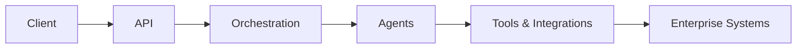
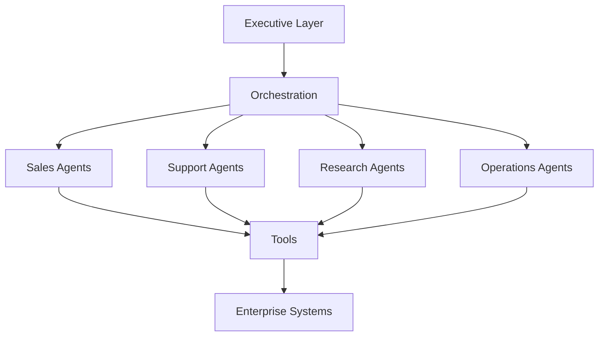

# Richard Russell

[Repositories](#key-repositories) • [Overview](#overview) • [Capabilities](#core-capabilities)

Founder @ AI Venture X

Building and deploying enterprise-grade multi-agent AI systems at scale (100+ agents across production workflows)

## Key Repositories

- [enterprise-agentic-ai](https://github.com/Poochaman/enterprise-agentic-ai) — enterprise-grade multi-agent AI systems for automation and integration  
- [multi-agent-orchestration](https://github.com/Poochaman/multi-agent-orchestration) — orchestration and routing across specialist agents  
- [ai-agent-organisation](https://github.com/Poochaman/ai-agent-organisation) — agent roles, governance, and organisational structure  
- [white-label-ai-api](https://github.com/Poochaman/white-label-ai-api) — stateless API for embedding AI agents at scale  

---

## Overview

I design and deploy production AI systems that operate as coordinated multi-agent environments rather than isolated tools.

My work combines:
- 20+ years delivering large-scale, FCA-regulated transformation programmes (£250m+)  
- enterprise system integration across data, cloud, and operational platforms  
- hands-on development of agentic AI systems and orchestration layers  

At AI Venture X:
- multi-agent systems operating across business workflows  
- AI structured as organisational models rather than standalone tools  
- orchestration layers built using OpenClaw and custom frameworks  

These systems:
- automate complex business processes  
- integrate with enterprise infrastructure  
- operate reliably under real-world constraints  
- produce measurable commercial outcomes  

---

## Core Capabilities

- Multi-agent system design and orchestration  
- AI agent organisations with defined roles and governance  
- Stateless API architectures for scalable deployment  
- Integration with CRMs, internal systems, and external APIs  
- Workflow automation and decision routing
- End-to-end delivery from architecture through to production deployment

---

## Current Focus

- Scaling multi-agent systems (100+ agents across production workflows)
- Building agentic orchestration layers using OpenClaw and custom frameworks  
- Developing AI-driven organisations with defined roles and workflows  
- Deploying AI agents across enterprise, gaming, and creator ecosystems  
- Supporting commercial AI systems operating in real-world environments  

---

## System Architecture

Typical deployment model:

Client Interface  
→ API Layer (authentication, routing, validation)  
→ Agent Layer (reasoning and coordination)  
→ Tool Layer (controlled execution)  
→ Enterprise Systems (CRM, data, messaging)  

Key principles:
- stateless interaction models  
- explicit routing and delegation  
- controlled tool access  
- full observability  

---

## Example Deployment

AI sales and support system:

Client → API → Routing → Sales Agent → CRM → Follow-up workflows  
Support queries → Support Agent → Knowledge base → Resolution  

Result:
- automated lead qualification  
- reduced support load  
- integrated workflow execution  

---

## Agent Organisation Model

Systems are structured as operational organisations rather than collections of isolated agents.

Typical structure includes:
- Executive layer (strategy, prioritisation, oversight)
- Functional agents (sales, support, research, operations)
- Orchestration layer (routing, delegation, coordination)
- Tool layer (controlled access to external systems)

Agents operate with defined roles, responsibilities, and delegation models, enabling coordinated execution across workflows.

AI Venture X operates multiple agent-driven systems structured as organisational models rather than single-agent tools.

These systems:
- consist of 100+ coordinated agents  
- operate with defined roles, responsibilities, and delegation models  
- are structured as functioning AI organisations  
- execute workflows across business, automation, and commercial use cases  

Two such systems are currently deployed using OpenClaw-based orchestration.

This approach enables:
- scalable task delegation  
- controlled execution  
- modular system design  
- real-world operational capability  

---

## Featured Work

### Enterprise Agentic AI  
Design and deployment of enterprise-grade multi-agent AI systems for automation, integration, and operational workflows.

### Multi-Agent Orchestration  
Implementation of orchestration layers coordinating specialist agents across structured workflows and decision pipelines.

### AI Agent Organisation  
Development of agent-driven systems structured as organisational models with defined roles, delegation, and governance.

### White-Label AI API  
Stateless API infrastructure for embedding AI agents into applications, enabling scalable, white-label deployment.

---

## Example Applications

- AI sales agents for lead qualification and conversion  
- Customer support automation  
- Internal knowledge assistants  
- Workflow automation across business functions  
- Embedded AI in SaaS platforms  
- AI-driven systems in gaming environments  
- AI integrations for creator and influencer ecosystems  

---

## Experience

- 5+ years designing and delivering production-grade agentic AI systems
- Architecture and operation of multi-agent environments (100+ agents)
- Cross-platform expertise (OpenAI, CrewAI, OpenClaw and others), applying consistent orchestration patterns across frameworks
- Enterprise deployments across Financial Services, Government, and commercial sectors
- Development of white-label AI infrastructure and API layers

---

## Background

- Former IBM / Samsung programme lead  
- Delivered £250m+ programmes across Financial Services, Government, and Insurance  
- Founder of AI Venture X  

---

## Book

Author of  
**The Scent of Thought: Dogs, Humans, and the Future of the AI Mind**

---

## Links

Website: https://www.aiventurex.com/  
LinkedIn: https://www.linkedin.com/company/ai-venture-x/  

---
